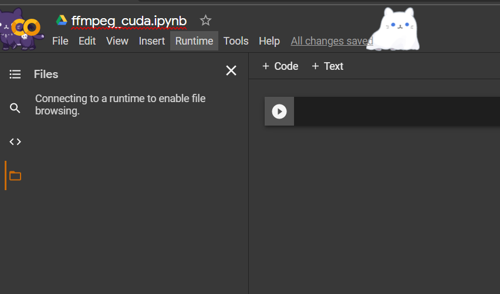

# colab-ffmpeg-cuda

FFmpeg build with CUDA support for Ubuntu (especially for Google Colab) with pre-built required binaries.

---

## Set Up

**Important:** You have to change the runtime type and use GPU hardware accelerator. If you have not done it, [check it below](#change-runtime-type-hardware-accelerator):

1. Clone the repository

```bash
# You need to prepend a `!` to execute a shell command in Goole Colab or Jupyter
!git clone https://github.com/rokibulislaam/colab-ffmpeg-cuda.git
```

2. Copy all the pre-built binaries from `./colab-ffmpeg-cuda/bin/` to `/usr/bin/` (**Recommended**)

```bash
!cp -r ./colab-ffmpeg-cuda/bin/. /usr/bin/
```

3. Check the installed `ffmpeg` version

```bash
!ffmpeg --version
# Congratulations, ffmpeg with cuda support is installed!
```

### Is it not working?

If you are having trouble with the pre-built binaries, buid the binaries from scratch (**It may take more than half an hour**)

```bash
!chmod +x ./colab-ffmpeg-cuda/build && ./colab-ffmpeg-cuda/build --build
```
There you go, ffmpeg with the required binaries should be installed to `/usr/bin`.

---

## Change Runtime Type (Hardware Accelerator)

1. Go to `Runtime` on top-left options

<p align="center">
 
</p>

2. Then go to `Change runtime type`

<p align="center">
 Change runtime type" title="Goto runtime -> Change runtime type" src="./assets/goto_runtime_then_goto_change_runtime_type.png" width="600" > 
</p>

3. Set `Hardware accelerator` type to `GPU`

<p align="center">
 Change runtime type -> Set hardware accelerator type to GPU" title="Goto runtime -> Change runtime type -> Set hardware accelerator type to GPU" src="./assets/set_hardware_accelerator_gpu.png" width="600" > 
</p>

## Supported Codecs

- `x264`: H.264 Video Codec (MPEG-4 AVC)
- `x265`: H.265 Video Codec (HEVC)
- `aom`: AV1 Video Codec (Experimental and very slow!)
- `fdk_aac`: Fraunhofer FDK AAC Codec
- `xvidcore`: MPEG-4 video coding standard
- `VP8/VP9/webm`: VP8 / VP9 Video Codec for the WebM video file format
- `mp3`: MPEG-1 or MPEG-2 Audio Layer III
- `ogg`: Free, open container format
- `vorbis`: Lossy audio compression format
- `theora`: Free lossy video compression format
- `opus`: Lossy audio coding format
- `srt`: Secure Reliable Transport
- `srt`: Secure Reliable Transport
- `webp`: Image format both lossless and lossy


### HardwareAccel

- `nv-codec`: [NVIDIA's GPU accelerated video codecs](https://devblogs.nvidia.com/nvidia-ffmpeg-transcoding-guide/). These encoders/decoders will only be available if a CUDA installation was found while building the binary. Luckily, Google Colab GPU instance comes already configured with CUDA and the pre-built binaries where built in the same environment. Supported codecs in nvcodec:
  - Decoders
    - H264 `h264_cuvid`
    - H265 `hevc_cuvid`
    - Motion JPEG `mjpeg_cuvid`
    - MPEG1 video `mpeg1_cuvid`
    - MPEG2 video `mpeg2_cuvid`
    - MPEG4 part 2 video `mepg4_cuvid`
    - VC-1 `vc1_cuvid`
    - VP8 `vp8_cuvid`
    - VP9 `vp9_cuvid`
  - Encoders
    - H264 `nvenc_h264`
    - H265 `nvenc_hevc`

_Read more: https://github.com/markus-perl/ffmpeg-build-script_

## Video Codec SDK version 8.2.15 Requirements:

Minimum required driver versions:
Linux: 396.24 or newer
Windows: 397.93 or newer

Optional CUDA 10 features:
Linux: 410.48 or newer
Windows: 411.31 or newer

_source: https://github.com/FFmpeg/nv-codec-headers/tree/sdk/8.2_

## Nvidia Driver Details

command: `nvidia-smi`

The current build is configured according to the following driver specifications. Incase the binaries or the build is not working, cross verify the requirements and the latest driver specifications in Google Colab.

As of `Tue Jan 5 17:00:29 2021` the Nvidia driver specification in Google Colab GPU instance is:

```
Tue Jan  5 17:00:29 2021
+-----------------------------------------------------------------------------+
| NVIDIA-SMI 460.27.04    Driver Version: 418.67       CUDA Version: 10.1     |
|-------------------------------+----------------------+----------------------+
| GPU  Name        Persistence-M| Bus-Id        Disp.A | Volatile Uncorr. ECC |
| Fan  Temp  Perf  Pwr:Usage/Cap|         Memory-Usage | GPU-Util  Compute M. |
|                               |                      |               MIG M. |
|===============================+======================+======================|
|   0  Tesla T4            Off  | 00000000:00:04.0 Off |                    0 |
| N/A   42C    P8     9W /  70W |      0MiB / 15079MiB |      0%      Default |
|                               |                      |                 ERR! |
+-------------------------------+----------------------+----------------------+

+-----------------------------------------------------------------------------+
| Processes:                                                                  |
|  GPU   GI   CI        PID   Type   Process name                  GPU Memory |
|        ID   ID                                                   Usage      |
|=============================================================================|
|  No running processes found                                                 |
+-----------------------------------------------------------------------------+
```

## Version verbose of pre-built binary
```
ffmpeg version 4.2.4 Copyright (c) 2000-2020 the FFmpeg developers
built with gcc 7 (Ubuntu 7.5.0-3ubuntu1~18.04)
configuration: --enable-cuda-nvcc --enable-cuvid --enable-nvenc --enable-libnpp --enable-cuda-llvm --pkgconfigdir=/content/workspace/lib/pkgconfig --prefix=/content/workspace --pkg-config-flags=--static --extra-cflags='-I/content/workspace/include -I/usr/local/cuda/include' --extra-ldflags='-L/content/workspace/lib -L/usr/local/cuda/lib64' --extra-libs='-lpthread -lm' --enable-static --disable-debug --disable-shared --disable-ffplay --disable-doc --enable-openssl --enable-gpl --enable-version3 --enable-nonfree --enable-pthreads --enable-libvpx --enable-libmp3lame --enable-libopus --enable-libtheora --enable-libvorbis --enable-libx264 --enable-libx265 --enable-runtime-cpudetect --enable-libfdk-aac --enable-avfilter --enable-libopencore_amrwb --enable-libopencore_amrnb --enable-filters --enable-libvidstab --enable-libaom --enable-libsrt
libavutil      56. 31.100 / 56. 31.100
libavcodec     58. 54.100 / 58. 54.100
libavformat    58. 29.100 / 58. 29.100
libavdevice    58.  8.100 / 58.  8.100
libavfilter     7. 57.100 /  7. 57.100
libswscale      5.  5.100 /  5.  5.100
libswresample   3.  5.100 /  3.  5.100
libpostproc    55.  5.100 / 55.  5.100
```
### More Info on the build

```
C compiler                gcc
C library                 glibc
ARCH                      x86 (generic)
big-endian                no
runtime cpu detection     yes
standalone assembly       yes
x86 assembler             nasm
MMX enabled               yes
MMXEXT enabled            yes
3DNow! enabled            yes
3DNow! extended enabled   yes
SSE enabled               yes
SSSE3 enabled             yes
AESNI enabled             yes
AVX enabled               yes
AVX2 enabled              yes
AVX-512 enabled           yes
XOP enabled               yes
FMA3 enabled              yes
FMA4 enabled              yes
i686 features enabled     yes
CMOV is fast              yes
EBX available             yes
EBP available             yes
debug symbols             no
strip symbols             yes
optimize for size         no
optimizations             yes
static                    yes
shared                    no
postprocessing support    yes
network support           yes
threading support         pthreads
safe bitstream reader     yes
texi2html enabled         no
perl enabled              yes
pod2man enabled           yes
makeinfo enabled          no
makeinfo supports HTML    no

External libraries:
alsa                    libopencore_amrwb       libx264
bzlib                   libopus                 libx265
iconv                   libsrt                  lzma
libaom                  libtheora               openssl
libfdk_aac              libvidstab              zlib
libmp3lame              libvorbis
libopencore_amrnb       libvpx

External libraries providing hardware acceleration:
cuda                    cuvid                   nvdec
cuda_llvm               ffnvcodec               nvenc
cuda_nvcc               libnpp                  v4l2_m2m

Libraries:
avcodec                 avformat                swresample
avdevice                avutil                  swscale
avfilter                postproc

Programs:
ffmpeg                  ffprobe

Enabled decoders:
aac                     g2m                     pgmyuv
aac_fixed               g723_1                  pgssub
aac_latm                g729                    pictor
aasc                    gdv                     pixlet
ac3                     gif                     pjs
ac3_fixed               gremlin_dpcm            png
adpcm_4xm               gsm                     ppm
adpcm_adx               gsm_ms                  prores
adpcm_afc               h261                    prosumer
adpcm_agm               h263                    psd
adpcm_aica              h263_v4l2m2m            ptx
adpcm_ct                h263i                   qcelp
adpcm_dtk               h263p                   qdm2
adpcm_ea                h264                    qdmc
adpcm_ea_maxis_xa       h264_cuvid              qdraw
adpcm_ea_r1             h264_v4l2m2m            qpeg
adpcm_ea_r2             hap                     qtrle
adpcm_ea_r3             hcom                    r10k
adpcm_ea_xas            hevc                    r210
adpcm_g722              hevc_cuvid              ra_144
adpcm_g726              hnm4_video              ra_288
adpcm_g726le            hq_hqa                  ralf
adpcm_ima_amv           hqx                     rasc
adpcm_ima_apc           huffyuv                 rawvideo
adpcm_ima_dat4          hymt                    realtext
adpcm_ima_dk3           iac                     rl2
adpcm_ima_dk4           idcin                   roq
adpcm_ima_ea_eacs       idf                     roq_dpcm
adpcm_ima_ea_sead       iff_ilbm                rpza
adpcm_ima_iss           ilbc                    rscc
adpcm_ima_oki           imc                     rv10
adpcm_ima_qt            imm4                    rv20
adpcm_ima_rad           indeo2                  rv30
adpcm_ima_smjpeg        indeo3                  rv40
adpcm_ima_wav           indeo4                  s302m
adpcm_ima_ws            indeo5                  sami
adpcm_ms                interplay_acm           sanm
adpcm_mtaf              interplay_dpcm          sbc
adpcm_psx               interplay_video         scpr
adpcm_sbpro_2           jacosub                 screenpresso
adpcm_sbpro_3           jpeg2000                sdx2_dpcm
adpcm_sbpro_4           jpegls                  sgi
adpcm_swf               jv                      sgirle
adpcm_thp               kgv1                    sheervideo
adpcm_thp_le            kmvc                    shorten
adpcm_vima              lagarith                sipr
adpcm_xa                libaom_av1              smackaud
adpcm_yamaha            libfdk_aac              smacker
agm                     libopencore_amrnb       smc
aic                     libopencore_amrwb       smvjpeg
alac                    libopus                 snow
alias_pix               libvorbis               sol_dpcm
als                     libvpx_vp8              sonic
amrnb                   libvpx_vp9              sp5x
amrwb                   loco                    speedhq
amv                     lscr                    srgc
anm                     m101                    srt
ansi                    mace3                   ssa
ape                     mace6                   stl
apng                    magicyuv                subrip
aptx                    mdec                    subviewer
aptx_hd                 metasound               subviewer1
arbc                    microdvd                sunrast
ass                     mimic                   svq1
asv1                    mjpeg                   svq3
asv2                    mjpeg_cuvid             tak
atrac1                  mjpegb                  targa
atrac3                  mlp                     targa_y216
atrac3al                mmvideo                 tdsc
atrac3p                 motionpixels            text
atrac3pal               movtext                 theora
atrac9                  mp1                     thp
aura                    mp1float                tiertexseqvideo
aura2                   mp2                     tiff
avrn                    mp2float                tmv
avrp                    mp3                     truehd
avs                     mp3adu                  truemotion1
avui                    mp3adufloat             truemotion2
ayuv                    mp3float                truemotion2rt
bethsoftvid             mp3on4                  truespeech
bfi                     mp3on4float             tscc
bink                    mpc7                    tscc2
binkaudio_dct           mpc8                    tta
binkaudio_rdft          mpeg1_cuvid             twinvq
bintext                 mpeg1_v4l2m2m           txd
bitpacked               mpeg1video              ulti
bmp                     mpeg2_cuvid             utvideo
bmv_audio               mpeg2_v4l2m2m           v210
bmv_video               mpeg2video              v210x
brender_pix             mpeg4                   v308
c93                     mpeg4_cuvid             v408
cavs                    mpeg4_v4l2m2m           v410
ccaption                mpegvideo               vb
cdgraphics              mpl2                    vble
cdxl                    msa1                    vc1
cfhd                    mscc                    vc1_cuvid
cinepak                 msmpeg4v1               vc1_v4l2m2m
clearvideo              msmpeg4v2               vc1image
cljr                    msmpeg4v3               vcr1
cllc                    msrle                   vmdaudio
comfortnoise            mss1                    vmdvideo
cook                    mss2                    vmnc
cpia                    msvideo1                vorbis
cscd                    mszh                    vp3
cyuv                    mts2                    vp4
dca                     mvc1                    vp5
dds                     mvc2                    vp6
dfa                     mwsc                    vp6a
dirac                   mxpeg                   vp6f
dnxhd                   nellymoser              vp7
dolby_e                 nuv                     vp8
dpx                     on2avc                  vp8_cuvid
dsd_lsbf                opus                    vp8_v4l2m2m
dsd_lsbf_planar         paf_audio               vp9
dsd_msbf                paf_video               vp9_cuvid
dsd_msbf_planar         pam                     vp9_v4l2m2m
dsicinaudio             pbm                     vplayer
dsicinvideo             pcm_alaw                vqa
dss_sp                  pcm_bluray              wavpack
dst                     pcm_dvd                 wcmv
dvaudio                 pcm_f16le               webp
dvbsub                  pcm_f24le               webvtt
dvdsub                  pcm_f32be               wmalossless
dvvideo                 pcm_f32le               wmapro
dxa                     pcm_f64be               wmav1
dxtory                  pcm_f64le               wmav2
dxv                     pcm_lxf                 wmavoice
eac3                    pcm_mulaw               wmv1
eacmv                   pcm_s16be               wmv2
eamad                   pcm_s16be_planar        wmv3
eatgq                   pcm_s16le               wmv3image
eatgv                   pcm_s16le_planar        wnv1
eatqi                   pcm_s24be               wrapped_avframe
eightbps                pcm_s24daud             ws_snd1
eightsvx_exp            pcm_s24le               xan_dpcm
eightsvx_fib            pcm_s24le_planar        xan_wc3
escape124               pcm_s32be               xan_wc4
escape130               pcm_s32le               xbin
evrc                    pcm_s32le_planar        xbm
exr                     pcm_s64be               xface
ffv1                    pcm_s64le               xl
ffvhuff                 pcm_s8                  xma1
ffwavesynth             pcm_s8_planar           xma2
fic                     pcm_u16be               xpm
fits                    pcm_u16le               xsub
flac                    pcm_u24be               xwd
flashsv                 pcm_u24le               y41p
flashsv2                pcm_u32be               ylc
flic                    pcm_u32le               yop
flv                     pcm_u8                  yuv4
fmvc                    pcm_vidc                zero12v
fourxm                  pcm_zork                zerocodec
fraps                   pcx                     zlib
frwu                    pgm                     zmbv

Enabled encoders:
a64multi                libopencore_amrnb       pcm_vidc
a64multi5               libopus                 pcx
aac                     libtheora               pgm
ac3                     libvorbis               pgmyuv
ac3_fixed               libvpx_vp8              png
adpcm_adx               libvpx_vp9              ppm
adpcm_g722              libx264                 prores
adpcm_g726              libx264rgb              prores_aw
adpcm_g726le            libx265                 prores_ks
adpcm_ima_qt            ljpeg                   qtrle
adpcm_ima_wav           magicyuv                r10k
adpcm_ms                mjpeg                   r210
adpcm_swf               mlp                     ra_144
adpcm_yamaha            movtext                 rawvideo
alac                    mp2                     roq
alias_pix               mp2fixed                roq_dpcm
amv                     mpeg1video              rv10
apng                    mpeg2video              rv20
aptx                    mpeg4                   s302m
aptx_hd                 mpeg4_v4l2m2m           sbc
ass                     msmpeg4v2               sgi
asv1                    msmpeg4v3               snow
asv2                    msvideo1                sonic
avrp                    nellymoser              sonic_ls
avui                    nvenc                   srt
ayuv                    nvenc_h264              ssa
bmp                     nvenc_hevc              subrip
cinepak                 opus                    sunrast
cljr                    pam                     svq1
comfortnoise            pbm                     targa
dca                     pcm_alaw                text
dnxhd                   pcm_dvd                 tiff
dpx                     pcm_f32be               truehd
dvbsub                  pcm_f32le               tta
dvdsub                  pcm_f64be               utvideo
dvvideo                 pcm_f64le               v210
eac3                    pcm_mulaw               v308
ffv1                    pcm_s16be               v408
ffvhuff                 pcm_s16be_planar        v410
fits                    pcm_s16le               vc2
flac                    pcm_s16le_planar        vorbis
flashsv                 pcm_s24be               vp8_v4l2m2m
flashsv2                pcm_s24daud             wavpack
flv                     pcm_s24le               webvtt
g723_1                  pcm_s24le_planar        wmav1
gif                     pcm_s32be               wmav2
h261                    pcm_s32le               wmv1
h263                    pcm_s32le_planar        wmv2
h263_v4l2m2m            pcm_s64be               wrapped_avframe
h263p                   pcm_s64le               xbm
h264_nvenc              pcm_s8                  xface
h264_v4l2m2m            pcm_s8_planar           xsub
hevc_nvenc              pcm_u16be               xwd
huffyuv                 pcm_u16le               y41p
jpeg2000                pcm_u24be               yuv4
jpegls                  pcm_u24le               zlib
libaom_av1              pcm_u32be               zmbv
libfdk_aac              pcm_u32le
libmp3lame              pcm_u8

Enabled hwaccels:
h264_nvdec              mpeg2_nvdec             vp9_nvdec
hevc_nvdec              mpeg4_nvdec             wmv3_nvdec
mjpeg_nvdec             vc1_nvdec
mpeg1_nvdec             vp8_nvdec

Enabled parsers:
aac                     dvd_nav                 mpegvideo
aac_latm                dvdsub                  opus
ac3                     flac                    png
adx                     g723_1                  pnm
av1                     g729                    rv30
avs2                    gif                     rv40
bmp                     gsm                     sbc
cavsvideo               h261                    sipr
cook                    h263                    tak
dca                     h264                    vc1
dirac                   hevc                    vorbis
dnxhd                   mjpeg                   vp3
dpx                     mlp                     vp8
dvaudio                 mpeg4video              vp9
dvbsub                  mpegaudio               xma

Enabled demuxers:
aa                      iff                     pcm_s8
aac                     ifv                     pcm_u16be
ac3                     ilbc                    pcm_u16le
acm                     image2                  pcm_u24be
act                     image2_alias_pix        pcm_u24le
adf                     image2_brender_pix      pcm_u32be
adp                     image2pipe              pcm_u32le
ads                     image_bmp_pipe          pcm_u8
adx                     image_dds_pipe          pcm_vidc
aea                     image_dpx_pipe          pjs
afc                     image_exr_pipe          pmp
aiff                    image_gif_pipe          pva
aix                     image_j2k_pipe          pvf
amr                     image_jpeg_pipe         qcp
amrnb                   image_jpegls_pipe       r3d
amrwb                   image_pam_pipe          rawvideo
anm                     image_pbm_pipe          realtext
apc                     image_pcx_pipe          redspark
ape                     image_pgm_pipe          rl2
apng                    image_pgmyuv_pipe       rm
aptx                    image_pictor_pipe       roq
aptx_hd                 image_png_pipe          rpl
aqtitle                 image_ppm_pipe          rsd
asf                     image_psd_pipe          rso
asf_o                   image_qdraw_pipe        rtp
ass                     image_sgi_pipe          rtsp
ast                     image_sunrast_pipe      s337m
au                      image_svg_pipe          sami
avi                     image_tiff_pipe         sap
avr                     image_webp_pipe         sbc
avs                     image_xpm_pipe          sbg
avs2                    image_xwd_pipe          scc
bethsoftvid             ingenient               sdp
bfi                     ipmovie                 sdr2
bfstm                   ircam                   sds
bink                    iss                     sdx
bintext                 iv8                     segafilm
bit                     ivf                     ser
bmv                     ivr                     shorten
boa                     jacosub                 siff
brstm                   jv                      sln
c93                     kux                     smacker
caf                     live_flv                smjpeg
cavsvideo               lmlm4                   smush
cdg                     loas                    sol
cdxl                    lrc                     sox
cine                    lvf                     spdif
codec2                  lxf                     srt
codec2raw               m4v                     stl
concat                  matroska                str
data                    mgsts                   subviewer
daud                    microdvd                subviewer1
dcstr                   mjpeg                   sup
dfa                     mjpeg_2000              svag
dhav                    mlp                     swf
dirac                   mlv                     tak
dnxhd                   mm                      tedcaptions
dsf                     mmf                     thp
dsicin                  mov                     threedostr
dss                     mp3                     tiertexseq
dts                     mpc                     tmv
dtshd                   mpc8                    truehd
dv                      mpegps                  tta
dvbsub                  mpegts                  tty
dvbtxt                  mpegtsraw               txd
dxa                     mpegvideo               ty
ea                      mpjpeg                  v210
ea_cdata                mpl2                    v210x
eac3                    mpsub                   vag
epaf                    msf                     vc1
ffmetadata              msnwc_tcp               vc1t
filmstrip               mtaf                    vividas
fits                    mtv                     vivo
flac                    musx                    vmd
flic                    mv                      vobsub
flv                     mvi                     voc
fourxm                  mxf                     vpk
frm                     mxg                     vplayer
fsb                     nc                      vqf
g722                    nistsphere              w64
g723_1                  nsp                     wav
g726                    nsv                     wc3
g726le                  nut                     webm_dash_manifest
g729                    nuv                     webvtt
gdv                     ogg                     wsaud
genh                    oma                     wsd
gif                     paf                     wsvqa
gsm                     pcm_alaw                wtv
gxf                     pcm_f32be               wv
h261                    pcm_f32le               wve
h263                    pcm_f64be               xa
h264                    pcm_f64le               xbin
hcom                    pcm_mulaw               xmv
hevc                    pcm_s16be               xvag
hls                     pcm_s16le               xwma
hnm                     pcm_s24be               yop
ico                     pcm_s24le               yuv4mpegpipe
idcin                   pcm_s32be
idf                     pcm_s32le

Enabled muxers:
a64                     hevc                    pcm_s24le
ac3                     hls                     pcm_s32be
adts                    ico                     pcm_s32le
adx                     ilbc                    pcm_s8
aiff                    image2                  pcm_u16be
amr                     image2pipe              pcm_u16le
apng                    ipod                    pcm_u24be
aptx                    ircam                   pcm_u24le
aptx_hd                 ismv                    pcm_u32be
asf                     ivf                     pcm_u32le
asf_stream              jacosub                 pcm_u8
ass                     latm                    pcm_vidc
ast                     lrc                     psp
au                      m4v                     rawvideo
avi                     matroska                rm
avm2                    matroska_audio          roq
avs2                    md5                     rso
bit                     microdvd                rtp
caf                     mjpeg                   rtp_mpegts
cavsvideo               mkvtimestamp_v2         rtsp
codec2                  mlp                     sap
codec2raw               mmf                     sbc
crc                     mov                     scc
dash                    mp2                     segafilm
data                    mp3                     segment
daud                    mp4                     singlejpeg
dirac                   mpeg1system             smjpeg
dnxhd                   mpeg1vcd                smoothstreaming
dts                     mpeg1video              sox
dv                      mpeg2dvd                spdif
eac3                    mpeg2svcd               spx
f4v                     mpeg2video              srt
ffmetadata              mpeg2vob                stream_segment
fifo                    mpegts                  sup
fifo_test               mpjpeg                  swf
filmstrip               mxf                     tee
fits                    mxf_d10                 tg2
flac                    mxf_opatom              tgp
flv                     null                    truehd
framecrc                nut                     tta
framehash               oga                     uncodedframecrc
framemd5                ogg                     vc1
g722                    ogv                     vc1t
g723_1                  oma                     voc
g726                    opus                    w64
g726le                  pcm_alaw                wav
gif                     pcm_f32be               webm
gsm                     pcm_f32le               webm_chunk
gxf                     pcm_f64be               webm_dash_manifest
h261                    pcm_f64le               webp
h263                    pcm_mulaw               webvtt
h264                    pcm_s16be               wtv
hash                    pcm_s16le               wv
hds                     pcm_s24be               yuv4mpegpipe

Enabled protocols:
async                   httpproxy               rtmpt
cache                   https                   rtmpte
concat                  icecast                 rtmpts
crypto                  libsrt                  rtp
data                    md5                     srtp
ffrtmpcrypt             mmsh                    subfile
ffrtmphttp              mmst                    tcp
file                    pipe                    tee
ftp                     prompeg                 tls
gopher                  rtmp                    udp
hls                     rtmpe                   udplite
http                    rtmps                   unix

Enabled filters:
abench                  deflate                 perms
abitscope               deflicker               perspective
acompressor             dejudder                phase
acontrast               delogo                  pixdesctest
acopy                   derain                  pixscope
acrossfade              deshake                 pp
acrossover              despill                 pp7
acrusher                detelecine              premultiply
acue                    dilation                prewitt
adeclick                displace                pseudocolor
adeclip                 doubleweave             psnr
adelay                  drawbox                 pullup
aderivative             drawgraph               qp
adrawgraph              drawgrid                random
aecho                   drmeter                 readeia608
aemphasis               dynaudnorm              readvitc
aeval                   earwax                  realtime
aevalsrc                ebur128                 remap
afade                   edgedetect              removegrain
afftdn                  elbg                    removelogo
afftfilt                entropy                 repeatfields
afifo                   eq                      replaygain
afir                    equalizer               reverse
aformat                 erosion                 rgbashift
agate                   extractplanes           rgbtestsrc
agraphmonitor           extrastereo             roberts
ahistogram              fade                    rotate
aiir                    fftdnoiz                sab
aintegral               fftfilt                 scale
ainterleave             field                   scale2ref
alimiter                fieldhint               scale_cuda
allpass                 fieldmatch              scale_npp
allrgb                  fieldorder              select
allyuv                  fifo                    selectivecolor
aloop                   fillborders             sendcmd
alphaextract            find_rect               separatefields
alphamerge              firequalizer            setdar
amerge                  flanger                 setfield
ametadata               floodfill               setparams
amix                    format                  setpts
amovie                  fps                     setrange
amplify                 framepack               setsar
amultiply               framerate               settb
anequalizer             framestep               showcqt
anlmdn                  freezedetect            showfreqs
anoisesrc               fspp                    showinfo
anull                   gblur                   showpalette
anullsink               geq                     showspatial
anullsrc                gradfun                 showspectrum
apad                    graphmonitor            showspectrumpic
aperms                  greyedge                showvolume
aphasemeter             haas                    showwaves
aphaser                 haldclut                showwavespic
apulsator               haldclutsrc             shuffleframes
arealtime               hdcd                    shuffleplanes
aresample               headphone               sidechaincompress
areverse                hflip                   sidechaingate
aselect                 highpass                sidedata
asendcmd                highshelf               signalstats
asetnsamples            hilbert                 signature
asetpts                 histeq                  silencedetect
asetrate                histogram               silenceremove
asettb                  hqdn3d                  sinc
ashowinfo               hqx                     sine
asidedata               hstack                  smartblur
asoftclip               hue                     smptebars
asplit                  hwdownload              smptehdbars
astats                  hwmap                   sobel
astreamselect           hwupload                spectrumsynth
atadenoise              hwupload_cuda           split
atempo                  hysteresis              spp
atrim                   idet                    sr
avectorscope            il                      ssim
avgblur                 inflate                 stereo3d
bandpass                interlace               stereotools
bandreject              interleave              stereowiden
bass                    join                    streamselect
bbox                    kerndeint               super2xsai
bench                   lagfun                  superequalizer
biquad                  lenscorrection          surround
bitplanenoise           life                    swaprect
blackdetect             limiter                 swapuv
blackframe              loop                    tblend
blend                   loudnorm                telecine
bm3d                    lowpass                 testsrc
boxblur                 lowshelf                testsrc2
bwdif                   lumakey                 threshold
cellauto                lut                     thumbnail
channelmap              lut1d                   thumbnail_cuda
channelsplit            lut2                    tile
chorus                  lut3d                   tinterlace
chromahold              lutrgb                  tlut2
chromakey               lutyuv                  tmix
chromashift             mandelbrot              tonemap
ciescope                maskedclamp             tpad
codecview               maskedmerge             transpose
color                   maskfun                 transpose_npp
colorbalance            mcdeint                 treble
colorchannelmixer       mcompand                tremolo
colorhold               mergeplanes             trim
colorkey                mestimate               unpremultiply
colorlevels             metadata                unsharp
colormatrix             midequalizer            uspp
colorspace              minterpolate            vaguedenoiser
compand                 mix                     vectorscope
compensationdelay       movie                   vflip
concat                  mpdecimate              vfrdet
convolution             mptestsrc               vibrance
convolve                negate                  vibrato
copy                    nlmeans                 vidstabdetect
cover_rect              nnedi                   vidstabtransform
crop                    noformat                vignette
cropdetect              noise                   vmafmotion
crossfeed               normalize               volume
crystalizer             null                    volumedetect
cue                     nullsink                vstack
curves                  nullsrc                 w3fdif
datascope               oscilloscope            waveform
dcshift                 overlay                 weave
dctdnoiz                owdenoise               xbr
deband                  pad                     xmedian
deblock                 pal100bars              xstack
decimate                pal75bars               yadif
deconvolve              palettegen              yadif_cuda
dedot                   paletteuse              yuvtestsrc
deesser                 pan                     zoompan

Enabled bsfs:
aac_adtstoasc           h264_redundant_pps      noise
av1_frame_split         hapqa_extract           null
av1_metadata            hevc_metadata           prores_metadata
chomp                   hevc_mp4toannexb        remove_extradata
dca_core                imx_dump_header         text2movsub
dump_extradata          mjpeg2jpeg              trace_headers
eac3_core               mjpega_dump_header      truehd_core
extract_extradata       mov2textsub             vp9_metadata
filter_units            mp3_header_decompress   vp9_raw_reorder
h264_metadata           mpeg2_metadata          vp9_superframe
h264_mp4toannexb        mpeg4_unpack_bframes    vp9_superframe_split

Enabled indevs:
alsa                    lavfi                   v4l2
fbdev                   oss

Enabled outdevs:
alsa                    oss
fbdev                   v4l2

```

---

_original project: https://github.com/markus-perl/ffmpeg-build-script_

_Please visit the original repo, modify it according to your needs_